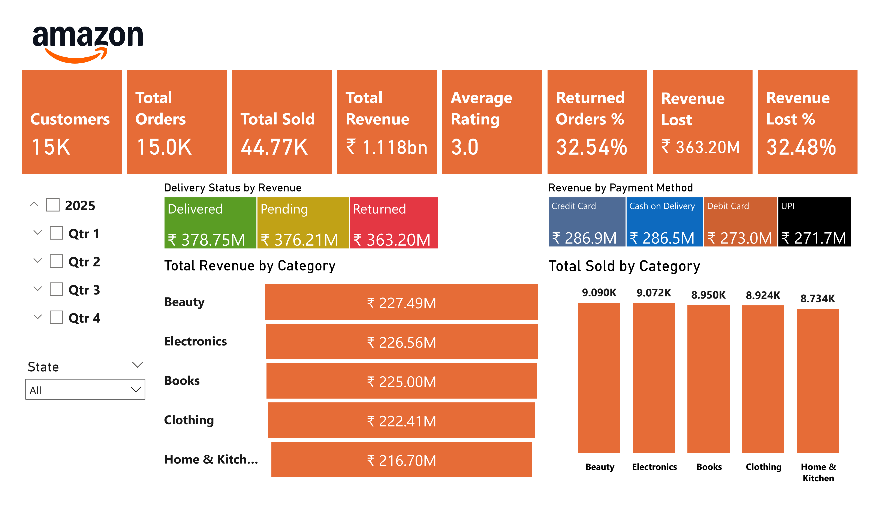
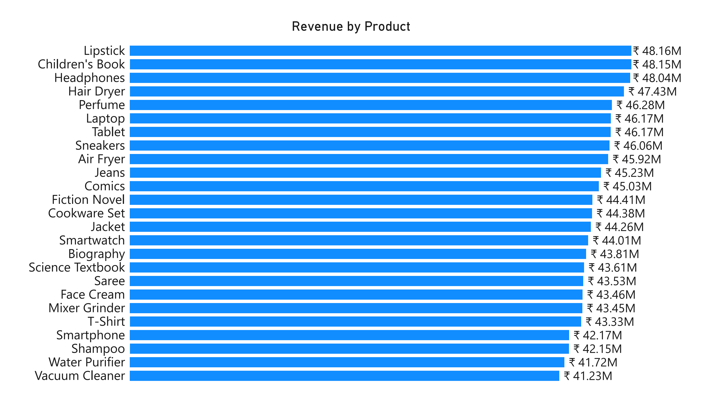
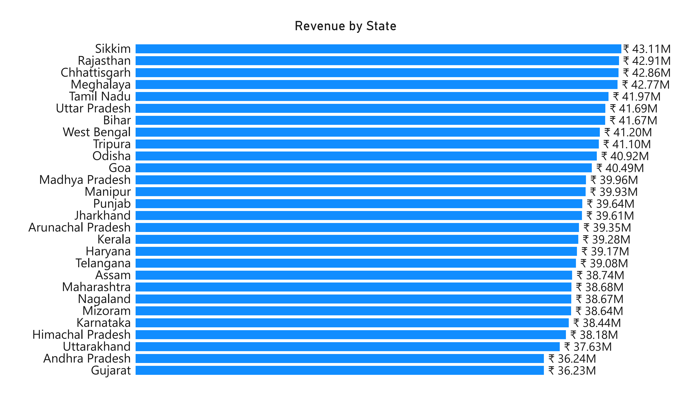

# Amazon India Sales 2025 Dashboard (Power BI)

## Objective
Analyze Amazon India sales performance, customer behavior, and revenue loss due to returns.

## Dataset
- [amazon_sales_2025_INR.csv](data/amazon_sales_2025_INR.csv) 

## Key KPIs
- Total Revenue
- Revenue Lost to Returns
- Revenue Lost Percentage
- Returned Orders Percentage
- Total Customers
- Total Purchases
- Average Rating

## Key Insights
- ~32% of orders were returned, resulting in ₹363.20M in lost revenue
- Certain categories drive most revenue but also higher returns

## Tools Used
- Power BI
- DAX
- Excel / CSV

## Screenshots

### Amazon India Sales 2025 Dashboard

### Revenue by Product

### Revenue by State

